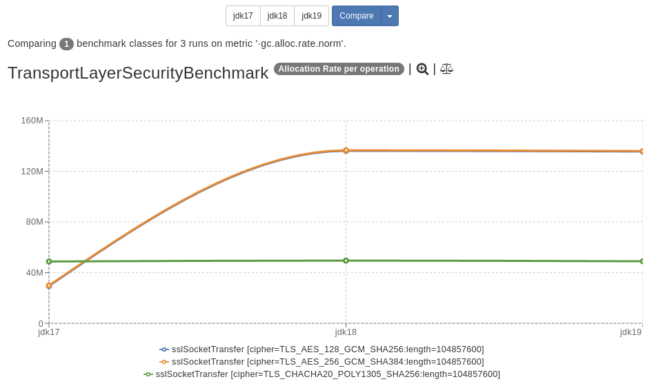
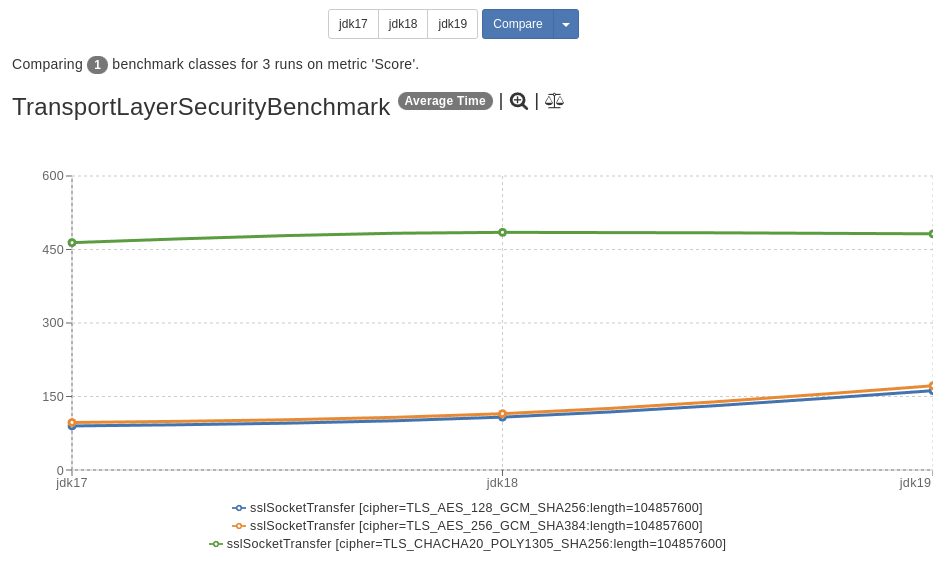

Java Cryptography Allocations
====================================
Analysis of java cryptography allocations.

This investigation was prompted by analysis of JDK19 performance on our RPC stack which uses SSLEngine with direct
buffers on the server, and apache-httpclient5 (socket-based) on the client. However, the performance regression
is reproducible with SSLSockets. This is meant to be a simple possible reproducer using jdk classes, and foregoing
HTTP. In an ideal world we wouldn't include handshakes in the measurement, but that has little to no impact upon the
results.

Running Locally
---------------

You may run using your preferred IDE using the main method in [TransportLayerSecurityBenchmark](./java-crypto-buffer-performance/src/main/java/com/palantir/java/crypto/allocations/TransportLayerSecurityBenchmark.java),
or by executing `./gradlew run`. Alternatively, you can build a zip archive using `./gradlew distZip` for execution in another environment.

Initial Benchmark Results
-------------------------

_Using an Intel Xeon W-2175 (x86_64) on linux kernel 5.15.0_
Benchmark results can be found in the [jmh-results directory](./jmh-results).

Allocations increase dramatically across the GCM ciphers (lower is generally better). It's unexpected that
a 100 MiB transfer results in more than ~100MiB of allocation.

Time to complete each operation increases, possibly as a result of the additional allocation. Lower values are better.

Gradle Tasks
------------
`./gradlew tasks` - to get the list of gradle tasks

Start Developing
----------------
Run one of the following commands:

* Open directly with IntelliJ using Gradle integration
* `./gradlew eclipse` for Eclipse
